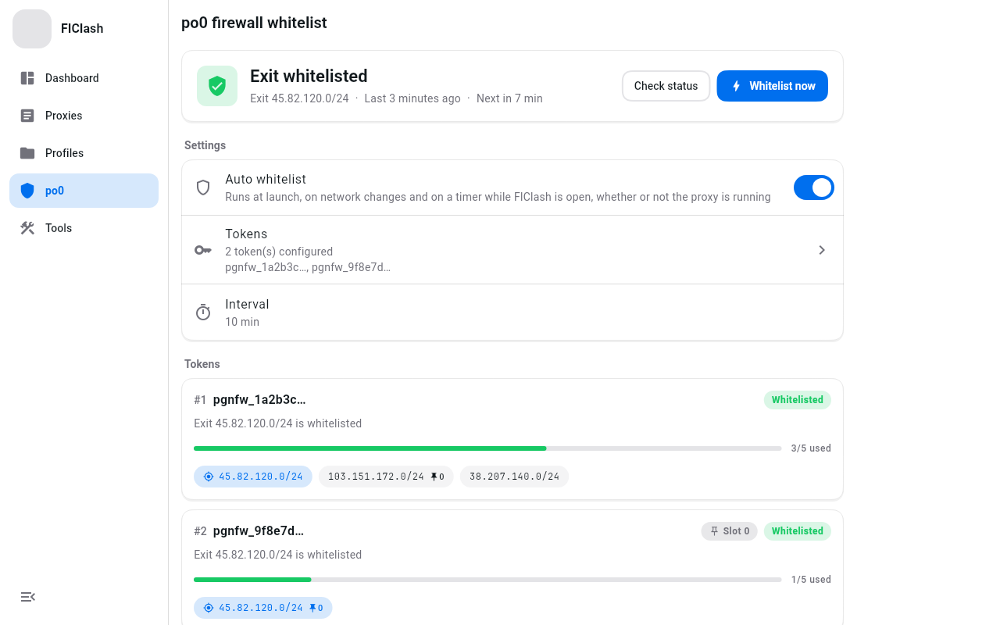

# po0-clash

[**English**](README.md)

基于 [FlClash](https://github.com/chen08209/FlClash) 的多平台代理客户端，内置 [po0fw](https://github.com/w0ven/po0fw) 的
po0 防火墙自动加白；Windows / macOS 使用 HeroUI 风格界面。

po0-clash 是独立的应用，应用 ID、安装标识、进程名、服务名和数据目录都与官方 FlClash 不同，可以和官方 FlClash 同时安装、同时运行。

<p align="center">
    <picture>
        <source media="(prefers-color-scheme: dark)" srcset="docs/features/images/ui_po0_dark.png">
        
    </picture>
</p>

## 功能

- **po0 自动加白**：为每台 po0 机器添加 `pgnfw_` token，应用打开期间按刷新间隔（默认 1 秒）检查白名单，本机出口不在名单时立即加白，
  无论代理是否开启。加白请求强制直连，加白的是真实出口而不是代理 IP。
- **HeroUI 风格桌面界面**：分组设置卡片、页面淡入、侧边栏动效。
- 保留 FlClash 的全部功能：基于 ClashMeta，支持订阅导入、WebDAV 同步、深色模式等。

## 安装

从 [Releases](https://github.com/yuuuki-creation/po0-clash/releases) 下载对应平台的产物。

| 平台 | 安装方式 |
|---|---|
| Windows | 运行 `po0-clash-<版本>-windows-amd64-setup.exe`；也可下载 `.zip` 解压后免安装运行。不会覆盖已安装的官方 FlClash |
| macOS | 在「终端」执行下方命令，自动识别 Apple Silicon / Intel 并安装到 `/Applications/po0-clash.app` |
| Android | 安装 `po0-clash-<版本>-android-arm64-v8a.apk`。无需卸载官方 FlClash，两者可以共存 |
| Linux / iOS | 暂不提供 |

```bash
curl -fsSL https://raw.githubusercontent.com/yuuuki-creation/po0-clash/main/scripts/install-macos.sh | bash
```

在 `bash` 前设置 `PO0CLASH_VERSION`（Release 标签，例如 `v5.0.0`）或 `PO0CLASH_DMG`（本地 dmg 或 URL）可安装指定版本。
macOS 版本未经 Apple 公证，安装脚本会移除隔离属性。更多选项见 [docs/install.md](docs/install.md)。

同一时间只在一个代理客户端里开启系统代理或 TUN，否则会互相抢占。

### 从旧版 FlClash-po0 迁移

`v0.8.98-po0.N` 旧构建以「FlClash」的身份安装，po0-clash 不会替换它们。在旧版「备份与恢复」中导出本地备份文件，
再导入 po0-clash（或直接重新填写 po0 token），然后自行卸载旧版；旧版不会再收到更新。

## 使用 po0 加白

1. 打开主导航中的「po0 加白」。
2. 添加 token（可填备注名和固定槽位），打开「自动加白」。
3. Android 首次开启后重启一次 VPN，直连路由才会生效。

## 开发

项目目标、功能设计、构建与发版流程见 [docs/](docs/README.md)；代码规范见 [AGENTS.md](AGENTS.md)。

## 致谢与许可

- [chen08209/FlClash](https://github.com/chen08209/FlClash)：上游客户端
- [w0ven/po0fw](https://github.com/w0ven/po0fw)：po0 防火墙加白逻辑

与上游相同，以 [GPL-3.0](LICENSE) 许可发布。
