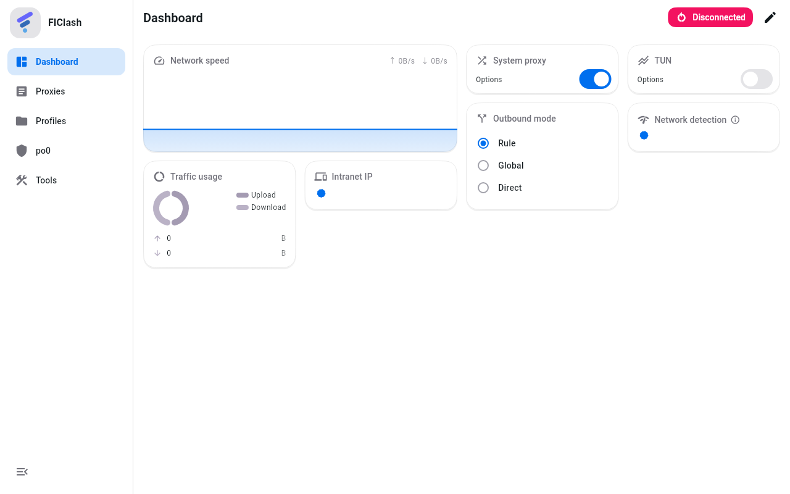
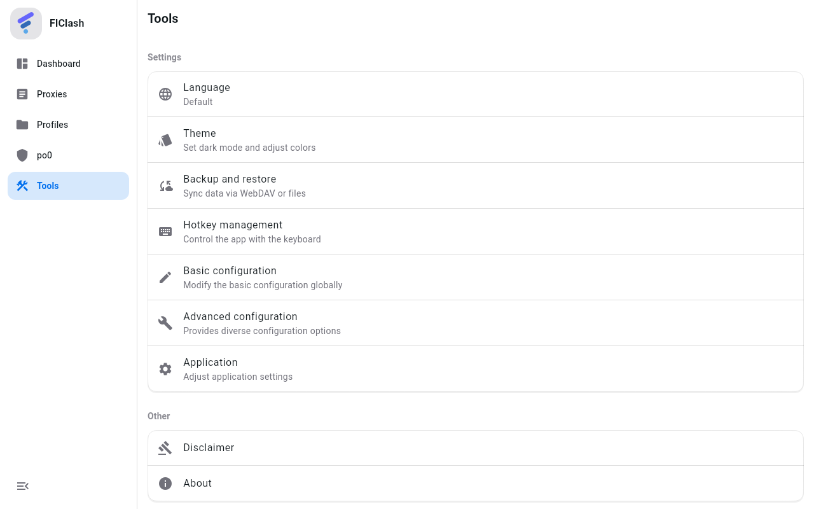

# 桌面端 HeroUI 风格界面

Windows 与 macOS 使用 [HeroUI](https://www.heroui.com)（原 NextUI）v2 默认主题的视觉语言；Android（以及 Linux）保持上游的 Material You 界面。

## 预览

以下为在构建机上用 HeroUI 主题渲染的预览（测试环境使用 Roboto 字体；实际应用在 Windows / macOS 上使用系统字体）。

| 仪表盘 | 工具（分组卡片） |
|---|---|
|  |  |

| po0（浅色） | po0（深色） |
|---|---|
|  |  |

Android 保持 Material 界面（po0 同样位于底部导航）：

## 开关方式

`lib/application.dart` 在构建 `MaterialApp` 主题时调用 `buildAppTheme(heroStyle: system.isWindows || system.isMacOS)`。
HeroUI 模式的唯一信号是 `ThemeData.extensions` 中存在 `HeroTheme`：组件通过 `HeroTheme.maybeOf(context)` 判断是否切换样式，
**不在组件里读取平台**。这样测试可以在任意主机上通过注入主题覆盖两种外观（见 `.agents/rules.md` 中关于平台分支可测试性的约定）。

## 设计令牌（`lib/common/hero_theme.dart`）

| 令牌 | 浅色 | 深色 |
|---|---|---|
| background | `#FFFFFF` | `#000000` |
| foreground | `#11181C` | `#ECEDEE` |
| content1 / content2 | `#FFFFFF` / `#F4F4F5` | `#18181B` / `#27272A` |
| default 100 / 200 / 300 / 500 | zinc `#F4F4F5` / `#E4E4E7` / `#D4D4D8` / `#71717A` | `#27272A` / `#3F3F46` / `#52525B` / `#A1A1AA` |
| primary | `#006FEE` | `#006FEE` |
| secondary（映射到 Material `tertiary`） | `#7828C8` | `#9353D3` |
| success / warning / danger | `#17C964` / `#F5A524` / `#F31260` | 同左 |
| divider | foreground 15% | foreground 15% |

圆角：small 8、medium 12、large 14。阴影近似 HeroUI `shadow-small`（两层柔和阴影 + 1px 环线）。

主题色：上游默认主题色映射为 HeroUI 蓝 `#006FEE`；用户在「主题」中选择的其他颜色会保留，并用 HeroUI 的
flat 规则派生容器色（强调色 16%/24% 叠加在 content1 上）。

## Material → HeroUI 映射

| Material 角色 | HeroUI 语义 |
|---|---|
| `surface` / `scaffoldBackgroundColor` | background |
| `surfaceContainerLow`（卡片） | content1 |
| `surfaceContainerHigh` / `Highest` | default-100 / default-200 |
| `onSurfaceVariant` | default-500（次要文字） |
| `primaryContainer` / `secondaryContainer` | primary flat（选中态） |
| `error` / `errorContainer` | danger / danger flat |

## 组件

- **按钮**：`FilledButton` = solid，`FilledButton.tonal` = flat，`OutlinedButton` = bordered（2px default-200），
  `TextButton` / `IconButton` = light（悬停 default-100）；统一 40px 高、12px 圆角、14px/500 字重。
- **开关**：白色圆形滑块在两种状态下保持同一尺寸，轨道选中为 primary、未选中为 default-200。
- **输入框**：flat 变体——default-100 填充、无边框，聚焦时 2px primary。
- **卡片**（`CommonCard`）：content1 背景、1px 环线 + 轻阴影、14px 圆角；选中态为 primary 边框 + flat 底色。
- **对话框 / 菜单 / 提示**：content1 背景，提示使用 shadow-small。
- **标签页**：去掉分隔线，选中项为 12px 圆角 flat 胶囊。
- **侧边栏**（`lib/manager/hero_sidebar.dart`）：替换 `NavigationRail`；展开 216px（图标 + 文字 + 应用名），
  折叠 72px（图标 + 悬停提示）；选中项为 primary flat 圆角胶囊，右侧 1px 分隔线；宽度动画期间内容按目标宽度布局并裁剪。

## 动效

| 场景 | 行为 | 位置 |
|---|---|---|
| 切换主页面 | 新页面 280ms 淡入并上移 1.5%（桌面页面原本直接跳转，没有过渡） | `PageEntrance`（`lib/pages/home.dart`） |
| 侧边栏选中 | 选中胶囊 320ms 滑动到新项，带轻微回弹；图标与文字颜色 200ms 渐变 | `HeroSidebar` |
| 卡片 | 悬停上浮 2px 并加深为 `shadow-medium`，按下缩放到 98.5%，均为 180ms | `_HeroCardFrame`（`lib/widgets/card.dart`） |
| 侧边弹出页 | 去掉全屏模糊，改为 HeroUI 半透明遮罩（浅色 35% / 深色 55%），面板内侧 14px 圆角 | `lib/widgets/sheet.dart` |
| po0 页面 | 状态标题切换淡入淡出、状态图标颜色渐变、占用进度条增长动画、token 卡片入场 | `lib/views/po0_firewall.dart` |

## 分组设置

`generateSection` 在 HeroUI 主题下把一组设置行放进同一张 `SurfaceCard`（content1 + 环线 + 轻阴影），
工具页、基础配置、网络等设置页因此呈现为分组卡片；Material 主题下保持上游的通栏行。

## 测试

`test/common/hero_theme_test.dart`（令牌、映射、组件主题）、`test/manager/hero_sidebar_test.dart`（侧边栏展开 / 折叠、选中胶囊滑动、卡片样式）
与 `test/views/po0_firewall_view_test.dart`（`SurfaceCard`、`generateSection` 分组、`PageEntrance`）。
上游的 `test/pages/home_test.dart` 不注入 HeroUI 主题，因此继续覆盖 `NavigationRail` 路径。
