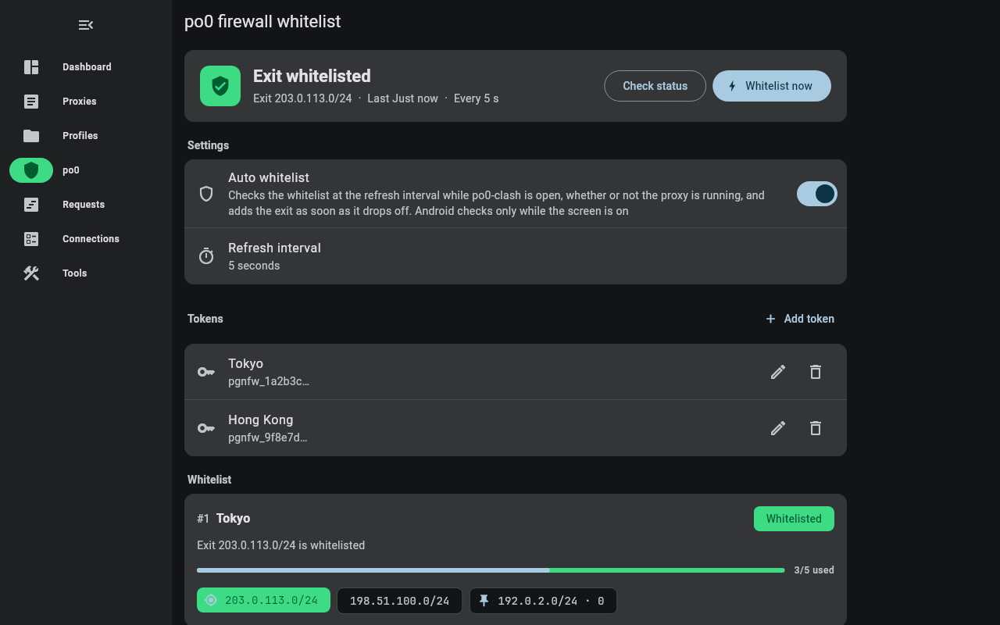
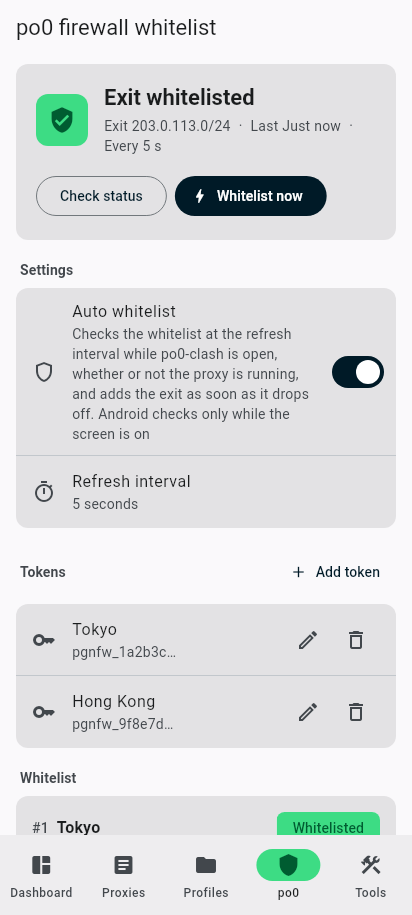

# Material 3 界面

Android、Windows、macOS 使用同一套 Material 3 界面，遵循 [Android 设计指南](https://developer.android.com/design/ui)。
决策记录见 [ADR 0008](../adr/0008-material3-on-every-platform.md)。

| 桌面（浅色） | 桌面（深色） | 手机 |
|---|---|---|
|  |  |  |

## 主题（`lib/common/app_theme.dart`）

- `buildAppTheme` 构建 Material 3 `ThemeData`，颜色来自 `genColorSchemeProvider`：
  - 用户选定的主题色，或系统种子色（Android 壁纸取色 / 桌面强调色）；
  - 配色方案变体、纯黑模式在三端都生效。
- 默认主题色是 Android 藏青 `#073042`（`androidBrandScheme`）：主要操作用藏青，选中态、容器用 Android 绿 `#3DDC84`，
  仿照 Android 设计网站；配色方案变体默认 `fidelity`。5.0.0 保存的旧默认主题（灰粉色 + content）读取时自动迁移。
- 模态弹窗、底部面板和侧边面板的背景统一使用 `ColorScheme.modalScrim`（scrim 32%），不做模糊。
- 颜色只使用配色方案中的角色。Material 3 没有 success / warning 角色，po0 页面借用 primary、tertiary 两族。

## 形状（`lib/common/shape.dart`）

| 档位 | 值 | 典型用途 |
|---|---|---|
| `extraSmall` | 4 | 菜单、输入框、提示消息、分组内的小块 |
| `small` | 8 | 标签、小徽章、色块 |
| `medium` | 12 | 卡片（`CommonCard`、`SurfaceCard` 的默认值）、图标容器 |
| `large` | 16 | FAB、侧边面板内侧、分组列表的外角 |
| `largeIncreased` | 20 | 预留 |
| `extraLarge` | 28 | 对话框、底部面板、全屏容器 |
| `full` | 1000 | 胶囊与圆形：指示器、进度条、导航选中态 |

- 形状都是普通圆角矩形（`RoundedRectangleBorder`、`ClipRRect`、`RRect`）。
- 组件圆角交给主题默认值，不在调用处重复声明；`withAppShapes` 只设置两项：
  - 输入框使用 `OutlineInputBorder`（extraSmall）；
  - 进度条两端为圆头。

## 导航（`lib/manager/app_manager.dart`、`lib/pages/home.dart`）

| 窗口宽度 | `ViewMode` | 导航 |
|---|---|---|
| < 600 dp | `mobile` | 底部 `NavigationBar` |
| 600～839 dp | `laptop` | 收起的 `NavigationRail`，标签在图标下方 |
| ≥ 840 dp | `desktop` | `NavigationRail`，默认展开（标签在右侧，宽 220 dp），顶部菜单按钮切换收起 / 展开，状态保存在「显示标签」设置 |

新安装默认使用简体中文，可在「语言」中改为跟随系统或其他语言。

## 转场

- **主页面切换**：fade through，共 300 ms（`Durations.medium2`）。
  - 前 35%：旧页面以 standard accelerate 淡出，然后页面视图跳转；
  - 后 65%：新页面以 emphasized decelerate 淡入，并从 92% 放大（`PageEntrance`）；
  - 「选项卡动画」设置或系统「减少动画」关闭时，瞬间切换。
- **推入页面**：`BaseNavigator.push` 使用 `MaterialPageRoute`，转场由 `appPageTransitionsTheme` 决定。
  - Android：`PredictiveBackPageTransitionsBuilder`，跟随预测性返回手势。
    清单中的 `android:enableOnBackInvokedCallback="true"` 是它的前提。
  - 其他平台：`FadeForwardsPageTransitionsBuilder`。
- **列表项展开为详情**：容器变换（`OpenContainer`），400 ms，emphasized 曲线。

## 动效规则

- **参数来源**：时长只取 `Durations.*`，曲线只取 `Easing.*`；emphasized 使用 `Curves.easeInOutCubicEmphasized`。
  不使用回弹、弹簧或抖动。
- **进入与退出**：进入用 decelerate，退出用 accelerate。
  `CurvedAnimation.reverseCurve` 和 `AnimatedSwitcher.switchOutCurve` 在反向播放时直接套用曲线，
  所以加速退出要写成 `Easing.xxxAccelerate.flipped`。
- **按场景选择**：

| 场景 | 做法 |
|---|---|
| 内容就地替换 | `FadeBox`：200 ms 交叉淡化，standard 曲线 |
| 图标、按钮切换与卡片进入 | `FadeScaleBox` / `FadeScaleEnterBox`：Material 3 淡入缩放，进入 150 ms 在前 30% 淡入并从 80% 放大，退出 75 ms 淡出 |
| 同一区域内容替换 | `FadeThroughBox`：fade through，300 ms |
| 拖动 | 提升高度（阴影），不缩放 |

- **减少动画**：系统开启「减少动画」时，`context.disableAnimations` 为真，入场与切换动画直接跳到终点。

## 组件

| 需求 | 组件 |
|---|---|
| 仪表盘出站模式切换 | `SegmentedButton` |
| 更多菜单（含二级菜单） | `CommonPopupBox` → `MenuAnchor` + `MenuItemButton` / `SubmenuButton`；菜单项的动作在菜单关闭后的下一帧执行 |
| 可点击 / 可删除 / 展示用标签 | `CommonChip` → `ActionChip` / `InputChip`；`MetaChip` → `Chip`（紧凑密度） |
| 卡片 | `CommonCard`：描边卡片或填充卡片，圆角 12，选中为 secondaryContainer，键盘焦点显示主色描边 |
| 分组面 | `SurfaceCard`：填充卡片（surfaceContainerHighest） |
| 桌面侧边面板 | `showModalSideSheet`：surfaceContainerLow，内侧圆角 16 |

桌面端遵循指针交互规范：悬停由组件自带的状态层表现；主题色块在右键时与长按一样进入删除模式。

## 测试

- `test/common/app_theme_test.dart`：主题、输入框与默认圆角。
- `test/common/navigator_test.dart`：推入的路由与各平台转场。
- `test/providers/state_derived_test.dart`：600 dp 边界。
- `test/views/po0_firewall_view_test.dart`：`SurfaceCard`、`PageEntrance`。
- `test/widgets/popup_test.dart`：菜单。
- `test/widgets/animated_visibility_test.dart`：导航显隐的减速进入与加速退出。
